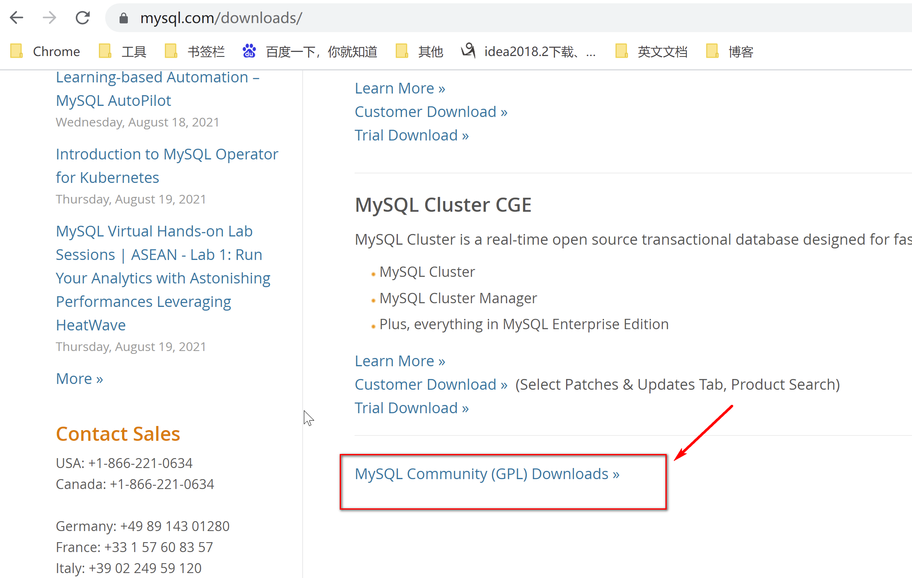
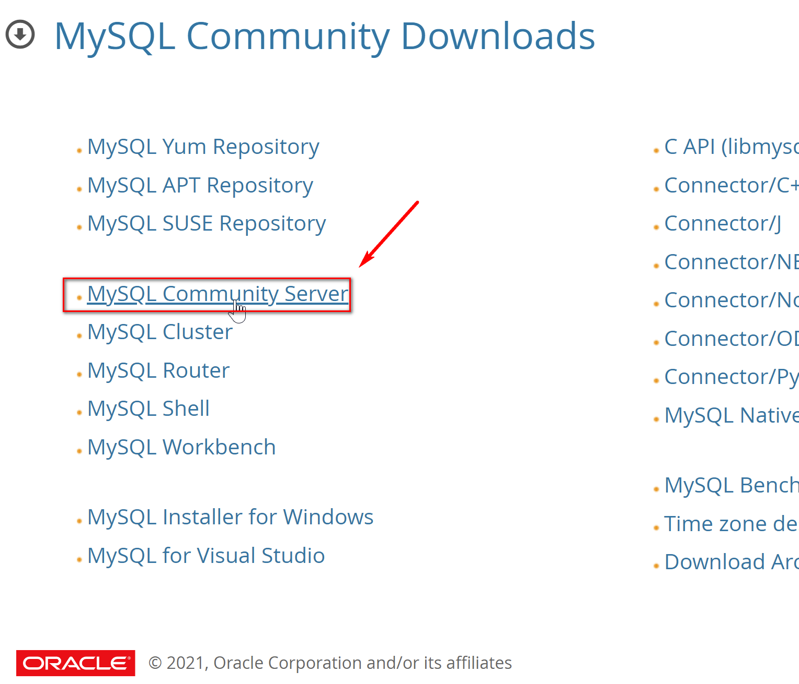
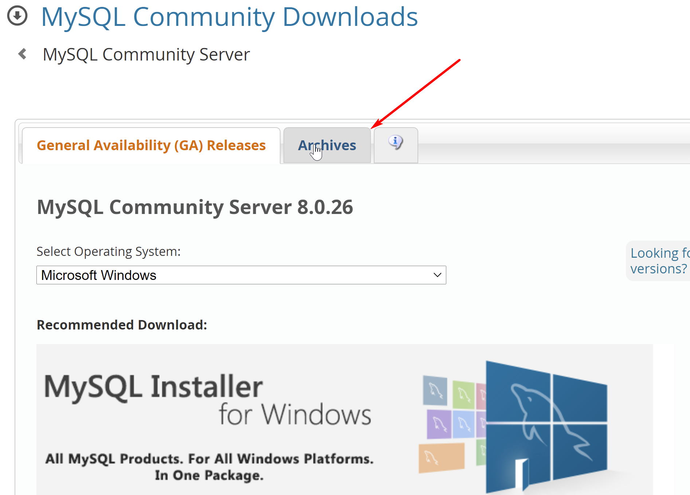
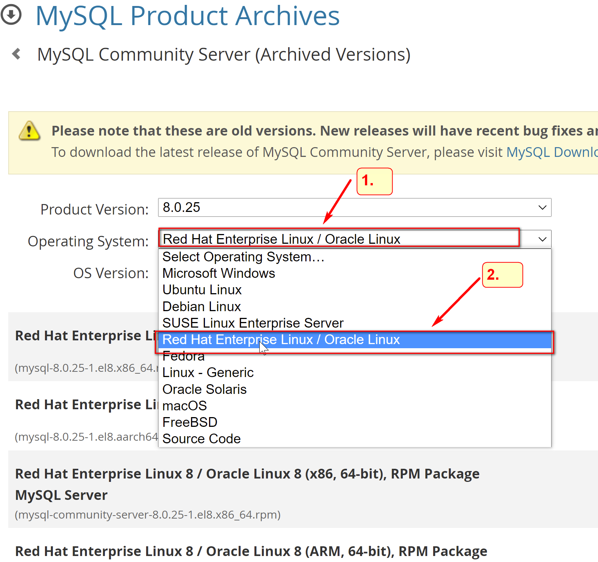
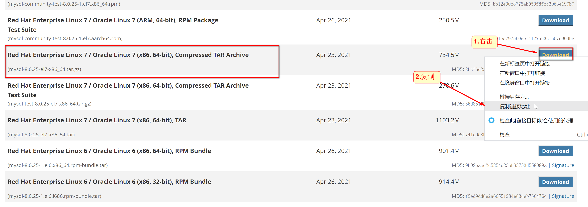
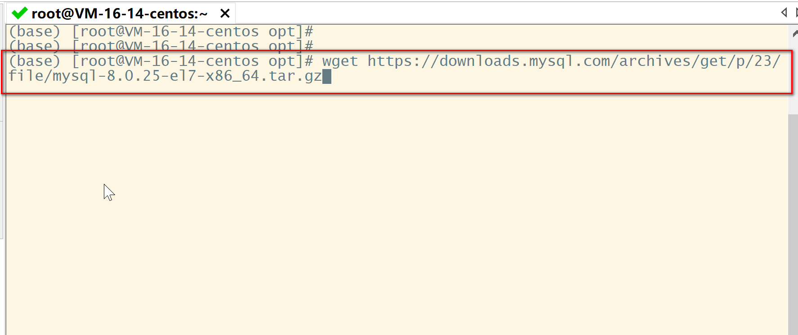
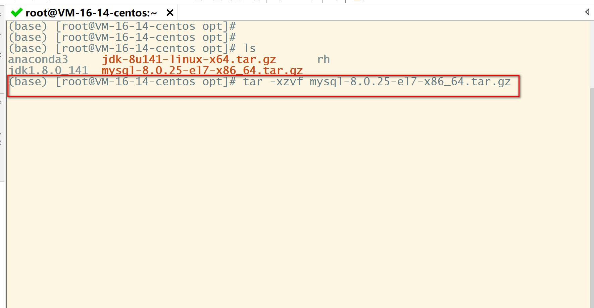
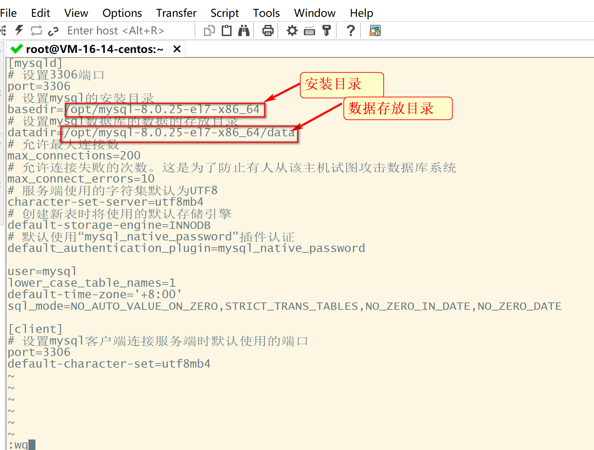
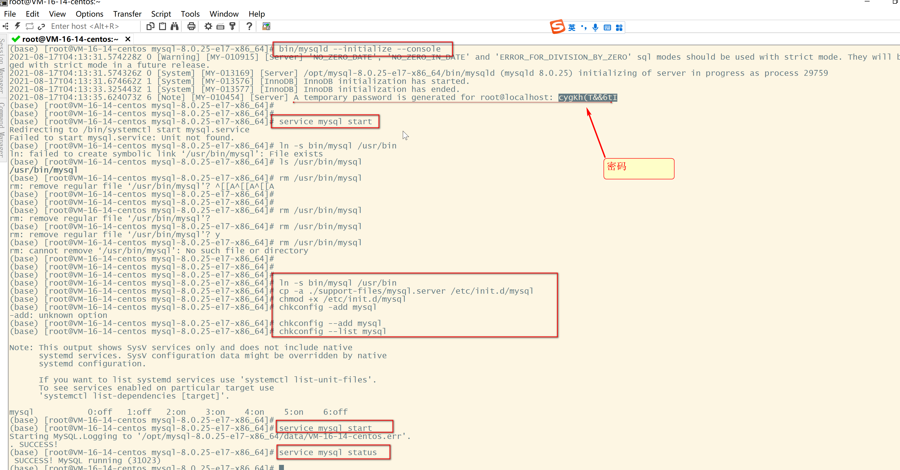
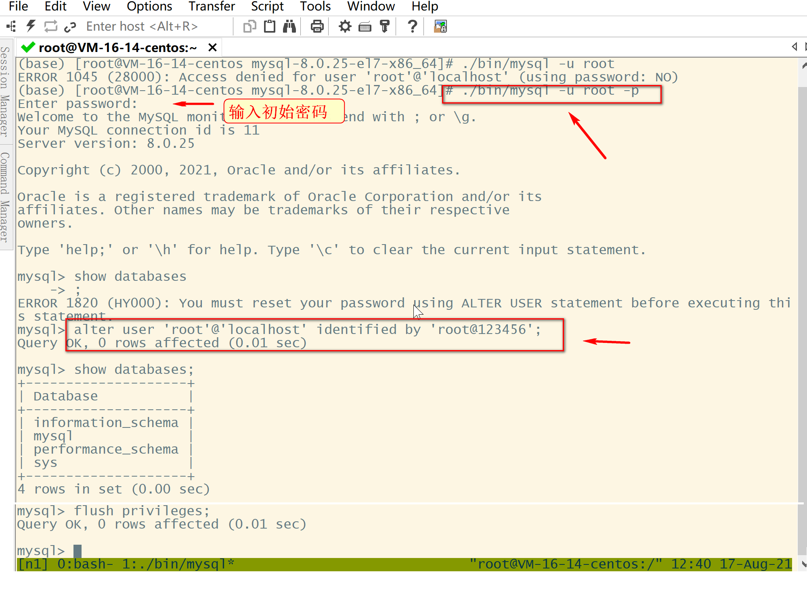

# 1.准备

环境：CentOS7/Linux

# 2.官网下载

[mysql官网下载](https://dev.mysql.com/downloads/) ，具体如下














去服务器下载

```
wget https://downloads.mysql.com/archives/get/p/23/file/mysql-8.0.25-el7-x86_64.tar.gz
```




# 3.安装

解压缩

```
tar -xzvf mysql-8.0.25-el7-x86_64.tar.gz 
```




编辑 /etc/my.cnf 文件（mysql8通用配置，没有该文件则新建）：

```
vi /etc/my.cnf
```

```
[mysqld]
# 设置3306端口
port=3306
# 设置mysql的安装目录
basedir=mysql安装目录
# 设置mysql数据库的数据的存放目录
datadir=mysql数据的存放目录
# 允许最大连接数
max_connections=200
# 允许连接失败的次数。这是为了防止有人从该主机试图攻击数据库系统
max_connect_errors=10
# 服务端使用的字符集默认为UTF8
character-set-server=utf8mb4
# 创建新表时将使用的默认存储引擎
default-storage-engine=INNODB
# 默认使用“mysql_native_password”插件认证
default_authentication_plugin=mysql_native_password

user=mysql
lower_case_table_names=1
default-time-zone='+8:00'
sql_mode=NO_AUTO_VALUE_ON_ZERO,STRICT_TRANS_TABLES,NO_ZERO_IN_DATE,NO_ZERO_DATE

[client]
# 设置mysql客户端连接服务端时默认使用的端口
port=3306
default-character-set=utf8mb4
```



初始化mysql

```
cd mysql-8.0.25-el7-x86_64
bin/mysqld --initialize --console
```

初始化完会有个临时密码，记得保存下来，一会需要修改密码(必须改)

有可能会安装失败缺少libnuma.so.1库(如果能成功安装，忽略这个)

```
通过如下命令安装libnuma.so.1库
yum install numactl -y
```

将MySQL服务加入自启动：

```
cp -a ./support-files/mysql.server /etc/init.d/mysql
chmod +x /etc/init.d/mysql
# 加入自启动
chkconfig --add mysql
# 检查服务是否生效
chkconfig --list mysql
```

具体过程，如下图（只需注意红框的代码）：

(我操作过程也遇到不少错，主要是和以前版本不太一样)



# 4.修改密码

```
./bin/mysql -u root -p
# 输入密码
alter user 'root'@'localhost' identified by 'root@123456';
```




# 5.卸载

若过程出现操作不当，需要卸载MySQL也很简单，因为是压缩包安装，所以只有两步

关闭MySQL服务：

```
service mysql stop
```

删除MySQL文件：

```
rm -rf $(find / -name mysql)
```
[我的GitHub](https://github.com/LoyalWilliams)

[我的gitbook](https://loyalwilliams.gitbook.io/myblog/v/main/08/windowslinux-shang-an-zhuang-jdk8)