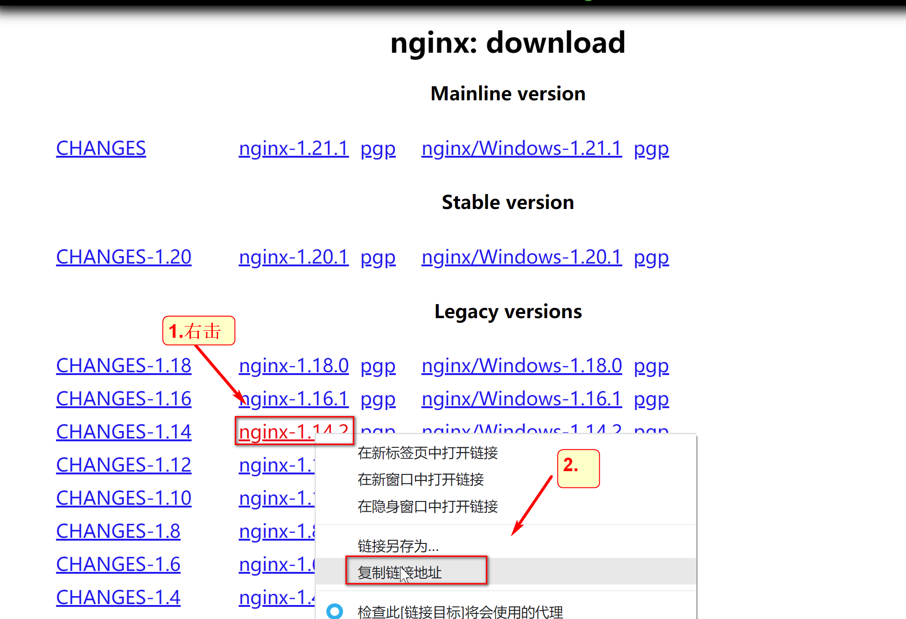
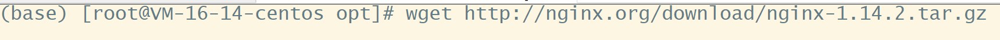
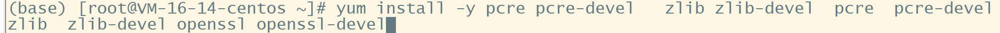
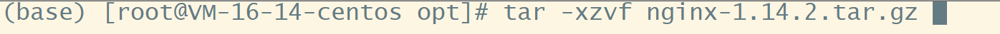
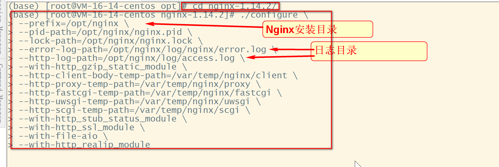
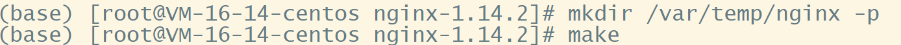
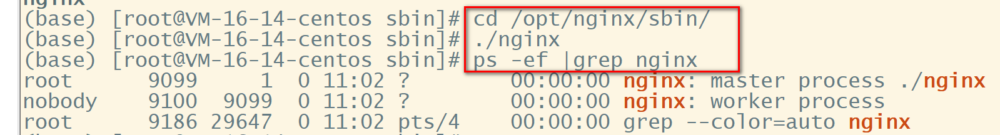
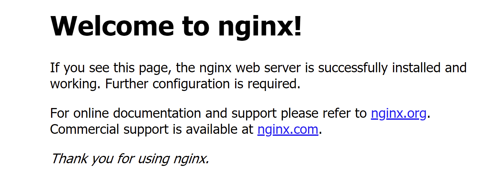

# 1.Nginx下载

[官网下载](http://nginx.org/en/download.html)



到安装目录下载

```
wget http://nginx.org/download/nginx-1.14.2.tar.gz
```




# 2.安装前必须安装的软件

```
yum install -y pcre pcre-devel   zlib zlib-devel  pcre  pcre-devel zlib  zlib-devel openssl openssl-devel
```




# 3.安装过程

解压到安装目录



进入到Nginx目录，进行配置

\ 表示换行，一定注意 \ 后面不能有空字符串！！！

```
cd Nginx的sbin目录
./configure \
--prefix=Nginx的安装目录 \
--pid-path=/opt/nginx/nginx.pid \
--lock-path=/opt/nginx/nginx.lock \
--error-log-path=/opt/nginx/log/nginx/error.log \
--http-log-path=/opt/nginx/log/access.log \
--with-http_gzip_static_module \
--http-client-body-temp-path=/var/temp/nginx/client \
--http-proxy-temp-path=/var/temp/nginx/proxy \
--http-fastcgi-temp-path=/var/temp/nginx/fastcgi \
--http-uwsgi-temp-path=/var/temp/nginx/uwsgi \
--http-scgi-temp-path=/var/temp/nginx/scgi \
--with-http_stub_status_module \
--with-http_ssl_module \
--with-file-aio \
--with-http_realip_module
```




```
mkdir /var/temp/nginx -p
make
make install
```




基本安装完成

# 4.启动Nginx

进入到Nginx安装的目录(configure的那个)

```
cd /opt/nginx/sbin/
./nginx
ps -ef |grep nginx #查看是否运行
```




打开网址(即服务器ip，默认是80端口)会看到如下页面



# 5.基本命令

```
nginx -s stop   # 停止Nginx，或者直接kill
nginx -s reload  # 刷新配置文件
nginx -c  /etc/nginx/nginx.conf # -c 指定配置文件路径启动
```


[我的GitHub](https://github.com/LoyalWilliams)