# Python数据可视化

代码已放到[GitHub](https://github.com/LoyalWilliams/data-visualization)

# 1.使用matplotlib绘制最简单的趋势图

先查看一下数据

```python
import pandas as pd
unrate = pd.read_csv('unrate.csv')  # 使用pandas读取数据
unrate['DATE'] = pd.to_datetime(unrate['DATE'])
print(unrate.head(12)) # 查看前12条数据
```

             DATE  VALUE
    0  1948-01-01    3.4
    1  1948-02-01    3.8
    2  1948-03-01    4.0
    3  1948-04-01    3.9
    4  1948-05-01    3.5
    5  1948-06-01    3.6
    6  1948-07-01    3.6
    7  1948-08-01    3.9
    8  1948-09-01    3.8
    9  1948-10-01    3.7
    10 1948-11-01    3.8
    11 1948-12-01    4.0

绘图

```python
import matplotlib.pyplot as plt
#%matplotlib inline
#Using the different pyplot functions, we can create, customize, and display a plot. For example, we can use 2 functions to :
first_twelve = unrate[0:12]
plt.plot(first_twelve['DATE'], first_twelve['VALUE'])
plt.show()
```


​    
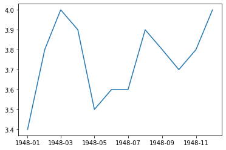
​    


```python
# 我们可以设置x轴的标签旋转
plt.plot(first_twelve['DATE'], first_twelve['VALUE'])
plt.xticks(rotation=45)
#print help(plt.xticks)
plt.show()
```


​    
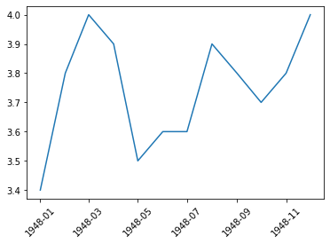
​    


```python
#xlabel(): 给x轴标签命名
#ylabel(): 给y轴标签命名
#title(): 绘图标题

plt.plot(first_twelve['DATE'], first_twelve['VALUE'])
plt.xticks(rotation=90)
plt.xlabel('Month')
plt.ylabel('Unemployment Rate')
plt.title('Monthly Unemployment Trends, 1948')
plt.show()
```


​    
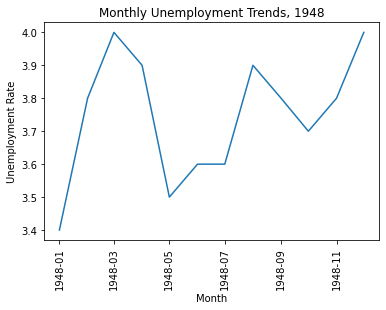

# 2.绘制多张图

## 2.1绘制子图

### 例子1


```python
#add_subplot(first,second,index) first:第几行,second：第几列，index：第几个图.
import pandas as pd
import matplotlib.pyplot as plt
import matplotlib.pyplot as plt
fig = plt.figure()
ax1 = fig.add_subplot(3,2,1)
ax2 = fig.add_subplot(3,2,2)
ax3 = fig.add_subplot(3,2,3)
ax4 = fig.add_subplot(3,2,6)
plt.show()
```


​    
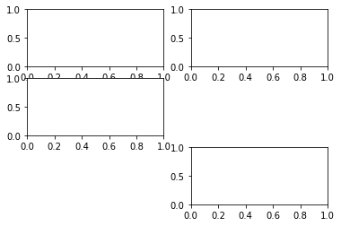
​    


###  例子2.例如绘制两个子图


```python
import numpy as np
fig = plt.figure()
#fig = plt.figure(figsize=(3, 3))
ax1 = fig.add_subplot(2,1,1)
ax2 = fig.add_subplot(2,1,2)

ax1.plot(np.random.randint(1,5,5), np.arange(5))
ax2.plot(np.arange(10)*3, np.arange(10))
plt.show()
```


​    
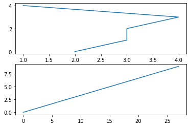
​    


## 2.2把多条曲线绘制到一个图里
### 例子1.用不同颜色绘制多条曲线


```python
unrate = pd.read_csv('unrate.csv')
unrate['DATE'] = pd.to_datetime(unrate['DATE'])

fig = plt.figure(figsize=(10,6))
unrate['MONTH'] = unrate['DATE'].dt.month
unrate['MONTH'] = unrate['DATE'].dt.month
colors = ['red', 'blue', 'green', 'orange', 'black']  #颜色
for i in range(5):
    start_index = i*12
    end_index = (i+1)*12
    subset = unrate[start_index:end_index]
    plt.plot(subset['MONTH'], subset['VALUE'], c=colors[i])
    
plt.show()
```


​    
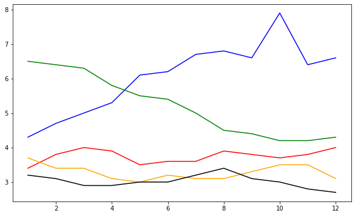
​    


### 例子2.把标签显示出来


```python
fig = plt.figure(figsize=(10,6))
colors = ['red', 'blue', 'green', 'orange', 'black']
for i in range(5):
    start_index = i*12
    end_index = (i+1)*12
    subset = unrate[start_index:end_index]
    label = str(1948 + i)
    plt.plot(subset['MONTH'], subset['VALUE'], c=colors[i], label=label)
plt.legend(loc='best')
# plt.legend(loc='upper left')
#print help(plt.legend)
plt.show()
```


​    
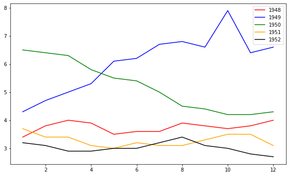
​    

# 绘制条形图
## 例子1.


```python
import pandas as pd
# fandango_scores.csv为电影评分的数据，第一列是电影名称，其余列是评分公司对应的评分
reviews = pd.read_csv('fandango_scores.csv')
cols = ['FILM', 'RT_user_norm', 'Metacritic_user_nom', 'IMDB_norm', 'Fandango_Ratingvalue', 'Fandango_Stars']
norm_reviews = reviews[cols]
print(norm_reviews[:1])
```

                                 FILM  RT_user_norm  Metacritic_user_nom  \
    0  Avengers: Age of Ultron (2015)           4.3                 3.55   
    
       IMDB_norm  Fandango_Ratingvalue  Fandango_Stars  
    0        3.9                   4.5             5.0  


```python
import matplotlib.pyplot as plt
from numpy import arange

num_cols = ['RT_user_norm', 'Metacritic_user_nom', 'IMDB_norm', 'Fandango_Ratingvalue', 'Fandango_Stars']

# 取第一行的电影评分数据进行绘制条形图，loc[行索引，列索引]取行列对应的数据
# 柱状图高度，即y轴
bar_heights = norm_reviews.loc[0,num_cols].values
print(bar_heights)
# 柱状图的水平位置，即x轴
bar_positions = arange(5) + 0.75
print(bar_positions)
fig, ax = plt.subplots()
ax.bar(bar_positions, bar_heights, 0.5)
plt.show()
```

    [4.3 3.55 3.9 4.5 5.0]
    [0.75 1.75 2.75 3.75 4.75]


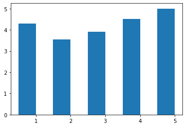
​    


## 例子2.竖状条形图


```python
# 默认x轴是整数值1,2,3,4,...
# 我们可以使用 Axes.set_xticks() 来改变x轴的标签值:

num_cols = ['RT_user_norm', 'Metacritic_user_nom', 'IMDB_norm', 'Fandango_Ratingvalue', 'Fandango_Stars']
bar_heights = norm_reviews.loc[0, num_cols].values
bar_positions = arange(5) + 0.75
tick_positions = range(1,6)
fig, ax = plt.subplots()

ax.bar(bar_positions, bar_heights, 0.5)
ax.set_xticks(tick_positions)
ax.set_xticklabels(num_cols, rotation=45)

ax.set_xlabel('Rating Source')
ax.set_ylabel('Average Rating')
ax.set_title('Average User Rating For Avengers: Age of Ultron (2015)')
plt.show()
```


​    
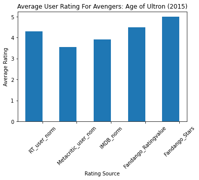
​    


## 例子3.横状条形图


```python
num_cols = ['RT_user_norm', 'Metacritic_user_nom', 'IMDB_norm', 'Fandango_Ratingvalue', 'Fandango_Stars']

bar_widths = norm_reviews.loc[0, num_cols].values
bar_positions = arange(5) + 0.75
tick_positions = range(1,6)
fig, ax = plt.subplots()
ax.barh(bar_positions, bar_widths, 0.5)

ax.set_yticks(tick_positions)
ax.set_yticklabels(num_cols)
ax.set_ylabel('Rating Source')
ax.set_xlabel('Average Rating')
ax.set_title('Average User Rating For Avengers: Age of Ultron (2015)')
plt.show()
```


​    
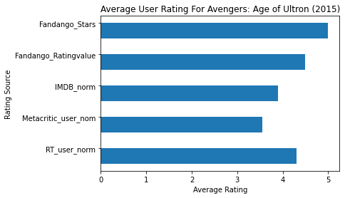
​    


# 散点图


```python
#Let's look at a plot that can help us visualize many points.
fig, ax = plt.subplots()
ax.scatter(norm_reviews['Fandango_Ratingvalue'], norm_reviews['RT_user_norm'])
ax.set_xlabel('Fandango')
ax.set_ylabel('Rotten Tomatoes')
plt.show()
```


​    
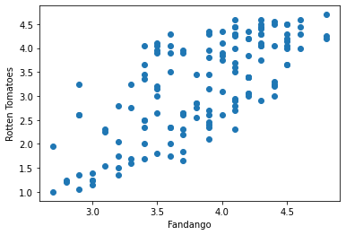
​    


# 绘制直方图（频数图）

## 例子1


```python
import pandas as pd
import matplotlib.pyplot as plt
reviews = pd.read_csv('fandango_scores.csv')
cols = ['FILM', 'RT_user_norm', 'Metacritic_user_nom', 'IMDB_norm', 'Fandango_Ratingvalue']
norm_reviews = reviews[cols]

fig, ax = plt.subplots()
# 频数图，水平方向表示范围，高度表示在某个范围的个数
ax.hist(norm_reviews['Fandango_Ratingvalue'])
# bins=，可以指定多少个箱子，默认是10个
ax.hist(norm_reviews['Fandango_Ratingvalue'],bins=20)
#ax.hist(norm_reviews['Fandango_Ratingvalue'], range=(4, 5),bins=20)
plt.show()
```


​    
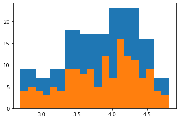
​    


# 绘制箱型图
不太常用，从下到上依次是最小值，1/4分位数,1/2分位数,3/4分位数,最大值
## 例子1


```python
fig, ax = plt.subplots()
ax.boxplot(norm_reviews['RT_user_norm'])
ax.set_xticklabels(['Rotten Tomatoes'])
ax.set_ylim(0, 5)
plt.show()
```


​    
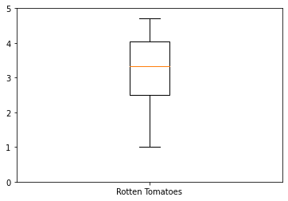
​    


## 例子2


```python
num_cols = ['RT_user_norm', 'Metacritic_user_nom', 'IMDB_norm', 'Fandango_Ratingvalue']
fig, ax = plt.subplots()
ax.boxplot(norm_reviews[num_cols].values)
ax.set_xticklabels(num_cols, rotation=90)
ax.set_ylim(0,5)
plt.show()
```


​    
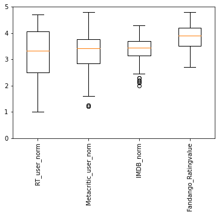
​    

# 绘制动态图
## 例子1.


```python
import numpy as np
import matplotlib.pyplot as plt
import matplotlib.animation as animation
# jupyter运行，需要输入下面这个命令
%matplotlib qt5

N = 20
plt.close() # 关闭打开的图形窗口
def anni():
    fig = plt.figure()
    plt.ion() # 打开交互式绘图interactive
    for i in range(N):
        plt.cla()           # 清除原有图像
        plt.xlim(-0.2,20.4) # 设置x轴坐标范围
        plt.ylim(-1.2,1.2)  # 设置y轴坐标范围
        # 每当i增加的时候，增加自变量x的区间长度，可以理解为不断叠加绘图，所以每次循环之前都使用plt.cla()命令清除原有图像
        x = np.linspace(0,i+1,1000) 
        y = np.sin(x)
        plt.plot(x,y)
        plt.pause(0.1)
    # plt.ioff() #关闭交互式绘图
    
    plt.show()

anni()

```

## 例子2.


```python
fig, ax = plt.subplots()
xdata, ydata = [], []
ln, = plt.plot([], [], 'ro',animated=True)

def init():
    ax.set_xlim(-np.pi,np.pi)
    ax.set_ylim(-1, 1)
    return ln,

def update(frame):
    xdata.append(frame)
    ydata.append(np.sin(frame))
    ln.set_data(xdata, ydata)
    return ln,

anim = animation.FuncAnimation(fig, update, frames=np.linspace(-np.pi,np.pi, 90),interval=10,
                    init_func=init,blit=True)
anim.save('test2.gif',writer='pillow')
plt.show()


```
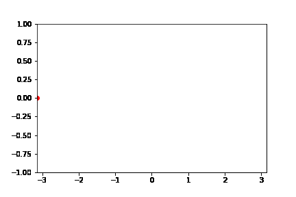
## 例子3


```python
import numpy as np
import matplotlib.pyplot as pl
import matplotlib.animation as animation

x = np.linspace(0, 10, 100)
y = np.sin(x)

fig, ax = plt.subplots()
line, = ax.plot(x, y, color='k')

def update(num, x, y, line):
    line.set_data(x[:num], y[:num])
    line.axes.axis([0, 10, -1, 1])
    return line,

ani = animation.FuncAnimation(fig, update, len(x), fargs=[x, y, line],
                              interval=25, blit=False)
ani.save('test3.gif',writer='pillow')
plt.show()

```
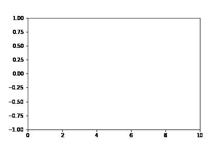

代码已放到[GitHub](https://github.com/LoyalWilliams/data-visualization)

