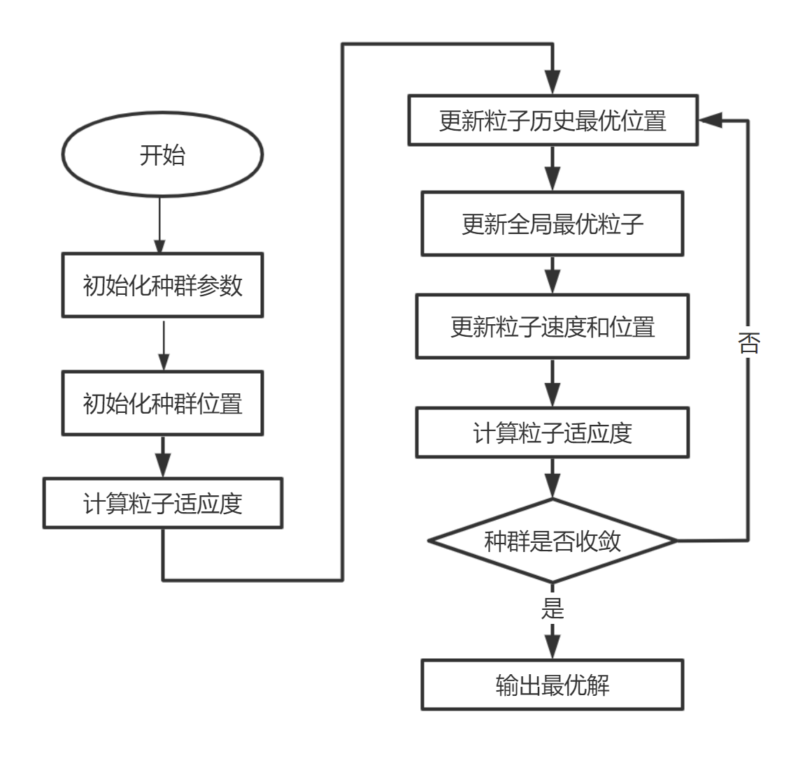
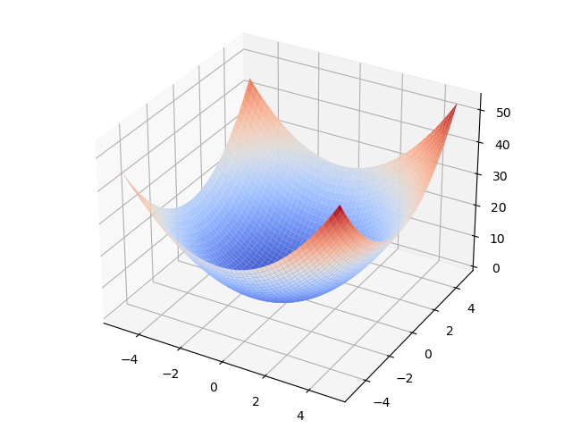
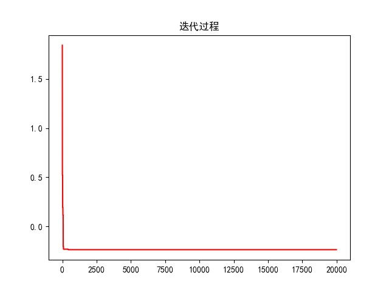

# 1.引言

粒子群优化算法起源于对鸟群觅食活动的分析。鸟群在觅食的时候通常会毫无征兆的聚拢，分散，以及改变飞行的轨迹，但是在不同个体之间会十分默契的保持距离。所以粒子群优化算法模拟鸟类觅食的过程，将待求解问题的搜索空间看作是鸟类飞行的空间，将每只鸟抽象成一个没有质量和大小的粒子，用这个粒子来表示待求解问题的一个可行解。所以，寻找最优解的过程就相当于鸟类觅食的过程。

​        粒子群算法也是基于种群以及进化的概念，通过个体间的竞争与协作，实现复杂空间最优解的求解。但是与遗传算法不同的是，他不会对每个个体进行“交叉”，“变异”等操作，而实以一定的规则，更新每个粒子的速度以及位置，使得每一个粒子向自身历史最佳位置以及全局历史最佳位置进行移动，从而实现整个种群向着最优的方向进化。

# 2.算法的具体描述：

## 2.1原理        

​    在粒子群优化算法中，粒子之间通过信息共享机制，获得其它粒子的发现与飞行经历。粒子群算法中的信息共享机制实际上是一种合作共生的行为，在搜索最优解的过程中，每个粒子能够对自己经过的最佳的历史位置进行记忆，同时，每个粒子的行为有会受到群体中其他例子的影响，所以在搜索最优解的过程中，粒子的行为既受其他粒子的影响，有受到自身经验的指导。

​       粒子群优化算法对于鸟群的模拟是按照如下的模式进行的：假设一群鸟在空中搜索食物，所有鸟知道自己当前距离食物有多远（这里的远近会用一个值来衡量，适应度值），那么每只鸟最简单的搜索策略就是寻找距离目前距离食物最近的鸟的周围空间。因此，在粒子群算法中，每个粒子都相当于一只鸟，每个粒子有一个适应度值，还有一个速度决定他们的飞行的距离与方向。所有的粒子追随当前最优的粒子在解空间中搜索。每搜索一次，最优的粒子会发生变化，其他的粒子又会追随新的最优粒子进行搜索，如此反复迭代。

图解：


​       在迭代开始的时候，每个粒子通过随机的方式初始化在空间中的速度和位置，然后在迭代过程中，粒子通过跟踪两个极值来自己在解空间中的位置和速度，一个极值是单个粒子自身在迭代的过程中的最优位置（就是最优适应度值所对应的空间解），这个称之为粒子的个体极值。另一个极值是种群中所有的粒子在迭代过程中所找到的最优位置，这个成为全局极值。如果粒子只是跟踪一个极值的话，则算法称为局部粒子群算法或者全局粒子群算法。

 PSO从这种模型中得到启示并用于解决优化问题。PSO 中，每个优化问题的潜在解都是搜索空间中的一只鸟，称之为粒子。所有的粒子都有一个由被优化的函数决定的适值( fitness value) ，每个粒子还有一个速度决定它们飞翔的方向和距离。然后粒子们就追随当前的最优粒子在解空间中搜索。

PSO初始化为一群随机粒子(随机解)，然后通过迭代找到最优解。在每一次迭代中，粒子通过跟踪两个极值来更新自己；第一个就是粒子本身所找到的最优解，这个解称为个体极值；另一个极值是整个种群目前找到的最优解，这个极值是全局极值。另外也可以不用整个种群而只是用其中一部分作为粒子的邻居，那么在所有邻居中的极值就是局部极值。

​    假设在一个n维的目标搜索空间中，有n个粒子组成一个群落，其中第i个粒子表示为一个n维的向量$X_i=(x_{i1},x_{i2},...,x_{in})$,维的向量，第i个粒子的飞行速度也是一个n维的向量，记为$V_i=(v_{i1},v_{i2},...,v_{in})$,速度向量的迭代公式为：

$V_{i}^{t+1}=V_{i-1}^{t}+c_{1}r_{1}(Pbest_{i}-X_i)+c_{2}r_{2}(Gbest-X_{i}))$

位置的迭代公式是:

$X_{i}^{t+1}=X_{i}^t+V_{i}^{t+1}$

其中，$Pbest_{i}​$ 表示粒子i的历史最佳位置，Gbest表示整个群体的历史最佳位置。$c_{1},c_{2}​$ 为学习因子，也称为加速常数，$r_{1},r_{2}​$ 为[0,1]范围内的均匀随机数，t表示迭代次数。


## 2.2标准粒子群算法流程

​    算法的流程如下：

​     Step1:种群初始化:可以进行随机初始化或根据被优化的问题设计特定的初始化方法,包括群体规模，每个粒子的位置$X_{i}$ 和速度$V_i$ ，然后计算每个粒子的适应度值，从而选择出个体的局部最优位置向量和种群的全局最优位置向量。

​    Step2:迭代设置:设置迭代次数$g_{max}$ ，令当前迭代次数g=1。

​    Step3:根据公式更新每个粒子的速度向量V。

​    Step4:根据公式更新每个粒子的位置向量X。

更新粒子历史最优位置

​    Step5:局部位置向量和全局位置向量更新:更新每个粒子的Pbest,和种群的Gbest。

​    Step6:终止条件判断:判断迭代次数时都达到$g_{max}$ 或误差是否足够小，如果满足则输出Gbest.否则继续进行选代，跳转至步骤(3)。

​        对于粒子群优化算法的实际应用，因为主要是对速度和位置向量迭代算子的设计计,选代算子是否合理将决定整个PSO算法性能的优劣.，所以如何设计 t pso的迭代算子是算法应用的研究重点和难点。





# 3.代码案例

## 3.0问题

求解f(x,y)的最小值点

$f(x,y)=x^2+y^2+x$

## 3.1绘图

```python
import numpy as np
import matplotlib.pyplot as plt
from matplotlib import cm
from mpl_toolkits.mplot3d import Axes3D

# 生成X和Y的数据
X=np.arange(-5,5,0.1)
print(X)
Y=np.arange(-5,5,0.1)
X,Y=np.meshgrid(X,Y)

# 目标函数
Z=X**2+Y**2+X

# 绘图
fig=plt.figure()
ax=Axes3D(fig)
surf=ax.plot_surface(X,Y,Z,cmap=cm.coolwarm)
plt.show()
```



## 3.2计算速度

```python
# 速度
# Vi+1 = w*Vi + c1 * r1 * (pbest_i - Xi) + c2 * r2 * (gbest_i - Xi)
# 位置
# Xi+1 = Xi + Vi+1
# vi, xi 分别表示粒子第i维的速度和位置
# pbest_i, gbest_i 分别表示某个粒子最好位置第i维的值、整个种群最好位置第i维的值

import numpy as np
import matplotlib.pyplot as plt
import matplotlib as mpl

mpl.rcParams['font.sans-serif'] = ['SimHei']  # 指定默认字体
mpl.rcParams['axes.unicode_minus'] = False  # 解决保存图像是负号'-'显示为方块的问题


```


## 3.3计算适应度

```python

def fitness_func(X):
    """计算粒子的的适应度值，也就是目标函数值，X 的维度是 size * 2 """
    A = 10
    pi = np.pi
    x = X[:, 0]
    y = X[:, 1]
    return x**2+y**2+x
```


## 3.4更新速度

```python

def velocity_update(V, X, pbest, gbest, c1, c2, w, max_val):
    """
    根据速度更新公式更新每个粒子的速度
    :param V: 粒子当前的速度矩阵，20*2 的矩阵
    :param X: 粒子当前的位置矩阵，20*2 的矩阵
    :param pbest: 每个粒子历史最优位置，20*2 的矩阵
    :param gbest: 种群历史最优位置，1*2 的矩阵
    """
    size = X.shape[0]
    r1 = np.random.random((size, 1))
    r2 = np.random.random((size, 1))
    V = w*V+c1*r1*(pbest-X)+c2*r2*(gbest-X)
    # 防止越界处理
    V[V < -max_val] = -max_val
    V[V > -max_val] = max_val
    return V
```


## 3.5更新粒子位置

```python

def position_update(X, V):
    """
    根据公式更新粒子的位置
    :param X: 粒子当前的位置矩阵，维度是 20*2
    :param V: 粒子当前的速度举着，维度是 20*2
    """
    return X+V
```


## 3.6主要算法过程

```python
def pos():
    w = 1
    c1 = 2
    c2 = 2
    r1 = None
    r2 = None
    dim = 2
    size = 20
    iter_num = 1000
    max_val = 0.5
    best_fitness = float(9e10)
    fitness_val_list = []
    # 初始化种群各个粒子的位置
    X = np.random.uniform(-5, 5, size=(size, dim))
    # 初始化各个粒子的速度
    V = np.random.uniform(-0.5, 0.5, size=(size, dim))
    # print(X)
    p_fitness = fitness_func(X)
    g_fitness = p_fitness.min()
    fitness_val_list.append(g_fitness)

    # 初始化的个体最优位置和种群最优位置
    pbest = X
    gbest = X[p_fitness.argmin()]
    # 迭代计算
    for i in range(1, iter_num):
        V = velocity_update(V, X, pbest, gbest, c1, c2, w, max_val)
        X = position_update(X, V)
        p_fitness2 = fitness_func(X)
        g_fitness2 = p_fitness2.min()

        # 更新每个粒子的历史最优位置
        for j in range(size):
            if p_fitness[j] > p_fitness2[j]:
                pbest[j] = X[j]
                p_fitness[j] = p_fitness2[j]
            # 更新群体的最优位置
            if g_fitness > g_fitness2:
                gbest = X[p_fitness2.argmin()]
                g_fitness = g_fitness2
            # 记录最优迭代记录
            fitness_val_list.append(g_fitness)
            i += 1

    # 输出迭代结果
    print("最优值是：%.5f" % fitness_val_list[-1])
    print("最优解是：x=%.5f,y=%.5f" % (gbest[0], gbest[1]))

    # 绘图
    plt.plot(fitness_val_list, color='r')
    plt.title('迭代过程')
    plt.show()


pos()
```

结果

最优值是：-0.23696
最优解是：x=-0.54359,y=-0.10555



参考：

苏振裕.《Python最优化实战》[M].北京大学出版社