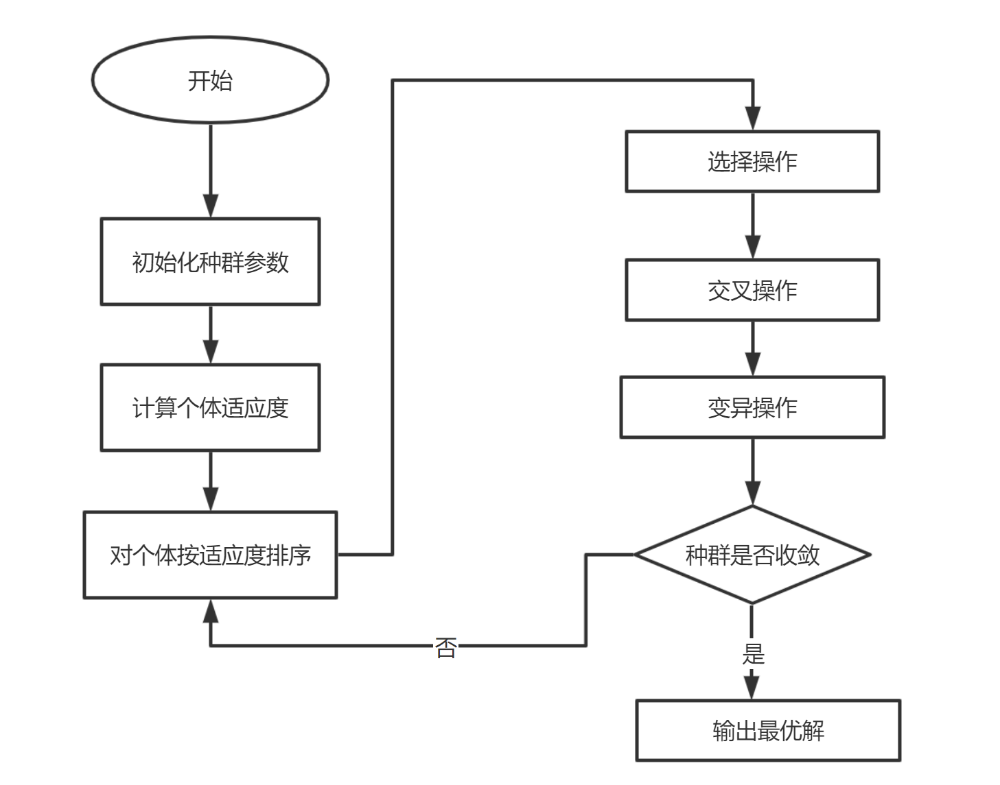
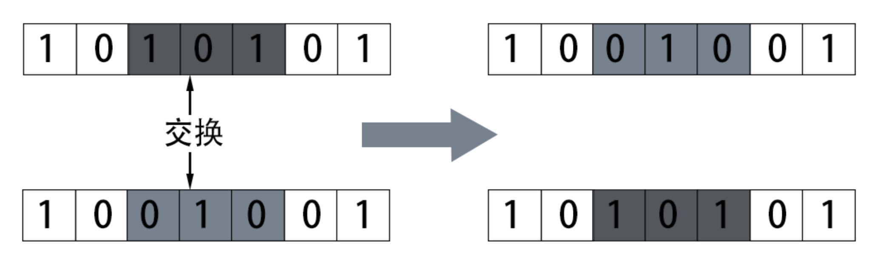
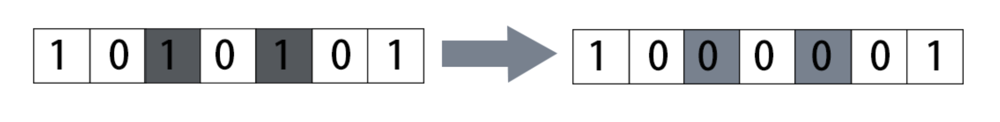
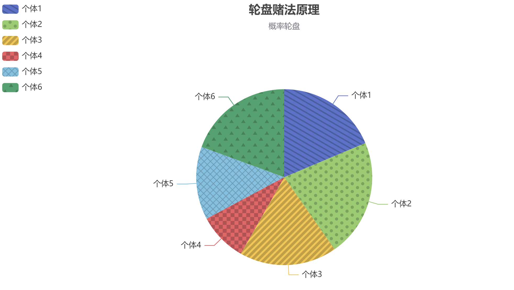
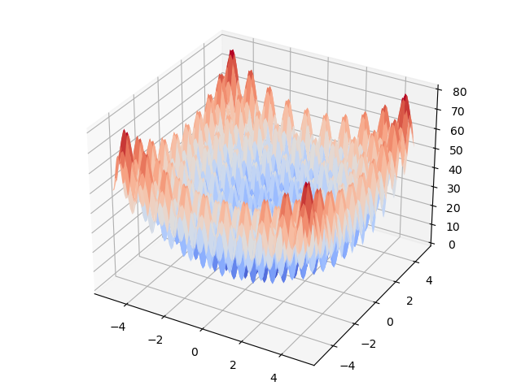
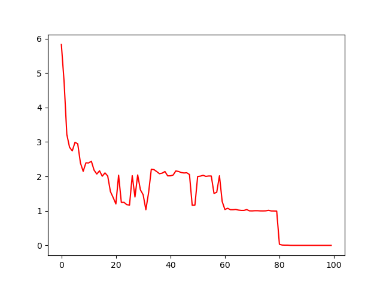

# 1. 遗传算法的科学定义

​	遗传算法（Genetic Algorithm, GA）是模拟达尔文生物进化论的自然选择和遗传学机理的生物进化过程的计算模型，是一种通过模拟自然进化过程搜索最优解的方法。

​	其主要特点是直接对结构对象进行操作，不存在求导和函数连续性的限定；具有内在的隐并行性和更好的全局寻优能力；采用概率化的寻优方法，不需要确定的规则就能自动获取和指导优化的搜索空间，自适应地调整搜索方向。

​	遗传算法以一种群体中的所有个体为对象，并利用随机化技术指导对一个被编码的参数空间进行高效搜索。其中，选择、交叉和变异构成了遗传算法的遗传操作；参数编码、初始群体的设定、适应度函数的设计、遗传操作设计、控制参数设定五个要素组成了遗传算法的核心内容。

​	遗传算法起源于对生物系统所进行的计算机模拟研究，它是模仿自然界生物进化机制发展起来的随机全局搜索和优化方法，借鉴了达尔文的进化论和孟德尔的遗传学说，其本质是一种高效、并行、全局搜索的方法，能在搜索过程中自动获取和积累有关搜索空间的知识，并自适应地控制搜索过程以求得最佳解。遗传算法寻优迭代流程如下图所示：



　　

# 2.进化论知识及遗传算法思想

## 2.1专业术语

　　遗传算法 ( GA , Genetic Algorithm ) ，也称进化算法 。 遗传算法是受达尔文的进化论的启发，借鉴生物进化过程而提出的一种启发式搜索算法。因此在介绍遗传算法前有必要简单的介绍生物进化知识，对专业的术语的理解也是必不可少的：

**种群 (Population)** ：生物的进化以群体的形式进行，这样的一个群体称为种群。

**个体(individual)**：组成种群的单个生物，算法里指染色体带有特征的实体，也可以理解为染色体。

**基因型(genotype)**：性状染色体的内部表现；在遗传算法中，由于编码方式不同，进化过程中解的形式和实际问题的形式会有所不同。如原始问题的一个解为$x_i=(-3,2)$ ，而二进制染色体的形式为$x_i'=00110010100$ (注意这里的二进制编码不是简单地把$x_i$ 转化为二进制拼在一起，具体往下看)，即染色体只能由0和1组成，所以需要一个映射函数和反映射函数，使问题的解和染色体表达形式能够进行**编码(encoding)**和**解码(decoding)**，即：

|      encoding      |        decoding        |
| :----------------: | :--------------------: |
| $x_i'=00110010100$ |      $x_i=(-3,2)$      |
|     =$f(x_i)$      |     =$f^{-1}(x_i)$     |
|     =$f(-3,2)$     | =$f^{-1}(00110010100)$ |

**表现型(phenotype)：** 染色体决定的性状的外部表现；在遗传算法中，表现型和基因型是一一对应的，如$x_i'=00110010100$ 是基因型，$x_i=(-3,2)$ 是表现型，表现型是最终实际问题的解的形式。

**编码(coding)：** DNA中遗传信息在一个长链上按一定的模式排列。遗传编码可看作从表现型到基因型的映射。

**解码(decoding)：** 基因型到表现型的映射。

**进化(evolution)：** 种群逐渐适应生存环境，品质不断得到改良。在算法中，进化就是不断的迭代，最终使得目标函数逼近全局最优解。

**适应度(fitness)：** 度量某个物种对于生存环境的适应程度。在算法中，其实就是计算的目标函数值。

**选择(selection)：** 以一定的概率从种群中选择若干个个体。一般，选择过程是一种基于适应度的优胜劣汰的过程。一种常用的选择策略是 **“比例选择”**，也就是个体被选中的概率与其适应度函数值成正比。假设群体的个体总数是M，那么那么一个体Xi被选中的概率为f(Xi)/( f(X1) + f(X2) + …….. + f(Xn) ) 。比例选择实现算法就是所谓的“轮盘赌算法”( Roulette Wheel Selection ) 。

**复制(reproduction)：** 算法里理解为选择的过程，就是复制父代个体形成子代个体。

**交叉(crossover)：** 两个染色体的某一相同位置处DNA被切断，前后两串分别交叉组合形成两个新的染色体，即交换部分染色体，也称基因重组或杂交。如下图演示了第3~5个基因随机交换的现象。



**变异(mutation)：**复制时可能（很小的概率）产生某些复制差错，变异产生新的染色体，表现出新的性状。受到环境影响可能会产生变异，在生物种群中，子代个体可能变得更聪明，或者由于变异产生某种遗传病。变异操作是染色体某个位置的随机突变，正常情况下突变概率很小，变异操作如下图所示，第3个和第5个位置的基因发生了突变。



**生存竞争，适者生存**：对环境适应度高的、牛B的个体参与繁殖的机会比较多，后代就会越来越多。适应度低的个体参与繁殖的机会比较少，后代就会越来越少。

**遗传与变异**：新个体会遗传父母双方各一部分的基因，同时有一定的概率发生基因变异。

 

## 2.2.遗传算法的编码方法

　　遗传算法常用的编码形式有二进制编码、格雷编码、实数编码、符号编码等。在前面讲解遗传算法基本概念是使用二进制编码为例进行的，由于二进制编码的方案与染色体基因的表现形式最接近、最容易理解，因此下面接着二进制编码的过程。

​        遗传算法的二进制编码由0和1组成，二进制编码和实数存在一一对应关系，染色体的长度决定$x_i$ 的精度。如有一变量$x\in [-1,2]$,其精度精确到小数后6位，则相当于将区间$[-1,2]$分成$3*10^6$等分，要用二进制表示这个区间范围，需要22位染色体长度，即$2097152=2^{21}<3*10^6<2^{22}=4194304$。

​	如何确定染色体长度？

​        假设有一决策变量$x\in[a,b]$,精确到小数点c位，用$l$ 位长度的染色体表示，则

<center>

$0000···000=a=2^0-1$($l$ 个0)

$111···111=b=2^m-1$ ($l$ 个1)

</center>


​	此处假设a=0是为了方便推到公式，这样可以得到编码精度$\Delta x=\frac{b-a}{2^m-1}$,若精度$\Delta x=10^c$,则有

$\frac{b-a}{10^c}\leq 2^m$,由此推出$m=log_2(b-a)+clog_210$.

所以染色体的长度为：$l=m$,当m为整数；$l=int(m)+1$,当m不为整数时。

​	如果有多个决策变量，则将所有的决策变量拼接在一起形成一个整体，相当于矩阵的一行。

​	得到染色体长度后，如何根据染色体的基因型反向计算表现型的值呢？

​	染色体是二进制数，而设计的变量是十进制数，这就设计到十进制和二进制的相互转换了。二进制转换十进制的公式如下：

<center>

$(b_0b_1···b_l)=\sum_{i=0}^l2^ib_i=x^t$

$x=a+x^t\frac{b-a}{2^l-1}$

</center>

​	类似，十进制也可以转二进制，这里就不啰嗦了。

## 2.3遗传算法的选择操作

​	遗传算法的选择操作是指选择种群中适应度高的个体形成的子代种群，常用的选择操作有轮盘赌法和精英策略。以下我们以轮盘赌法作为讲解。

​	其核心思想是不等概率有放回抽样，如下所示，将个体的适应度做归一化计算，归一化值即为个体被选择的概率。

​	归一化：Xi被选中的概率为P=f(Xi)/( f(X1) + f(X2) + …….. + f(Xn) )

|  个体  | 适应度  | 归一化适应度 | 被选择概率 |
| :--: | :--: | :----: | :---: |
|  1   |  25  |  0.19  | 0.19  |
|  2   |  29  |  0.22  | 0.22  |
|  3   |  24  |  0.18  | 0.18  |
|  4   |  12  |  0.09  | 0.09  |
|  5   |  18  |  0.13  | 0.13  |
|  6   |  26  |  0.19  | 0.19  |




​	然后进行有放回的抽样，直到抽样规模达到种群的规模时停止，个体被选中的概率由其适应度决定。

​	在Python中，实现指定概率抽样的代码如下：

```python
import numpy as np
np.random.choice([1,2,3,4,5,6],size=6,p=[0.19,0.22,0.18,0.09,0.13,0.19])
```

​	轮盘赌算法的一个简单的实现如下：

```python
轮盘赌算法
def select(X, fitness):
    """根据轮盘赌法选择优秀个体"""
    # fitness越小表示越优秀，被选中的概率越大，做 1/fitness 处理
    fitness = 1 / fitness  
    fitness = fitness / fitness.sum()  # 归一化
    idx = np.array(list(range(X.shape[0])))
    # 根据概率选择
    X2_idx = np.random.choice(idx, size=X.shape[0], p=fitness)  
    X2 = X[X2_idx, :]
    return X
```


# 3.算法流程

算法的流程如下：

​     Step1:种群初始化:进行随机初始化每个个体的染色体的基因型。

​    Step2:迭代设置:设置迭代次数$g_{max}$ ，令当前迭代次数g=1。

​    Step3:染色体解码，根据染色体的表现型计算个体适应度。

​    Step4:适者生存，只有优秀的个体才能存活，即对个体进行选择操作。

​    Step5:产生下一代个体，即对染色体进行交叉、变异操作。

​    Step6:终止条件判断：判断迭代次数时都达到$g_{max}$ 或误差是否足够小，如果满足则输出染色体的表现型和适应值；否则继续进行跌代，跳转至Step3。

# 4.代码

## 4.1 问题

​	求Rastrigin函数的最小值。

​	Rastrigin函数:$f(x,y)=2a+x^2-acos2\pi x+y^2-acos2\pi y$

## 4.2 绘图

画出Rastrigin函数的图像

```
import numpy as np
import matplotlib.pyplot as plt
from matplotlib import cm
from mpl_toolkits.mplot3d import Axes3D

# 生成X和Y的数据
X = np.arange(-5, 5, 0.1)
Y = np.arange(-5, 5, 0.1)
X, Y = np.meshgrid(X, Y)
a = 10
# 目标函数
Z = 2 * a + X ** 2 - a * np.cos(2 * np.pi * X) + Y ** 2 - a * np.cos(2 * np.pi * Y)


# 绘图
fig = plt.figure()
ax = Axes3D(fig)
surf = ax.plot_surface(X, Y, Z, cmap=cm.coolwarm)
plt.show()
```



## 4.3 问题分析

​	在Rastrigin中有两个变量x和y，取值范围都是[-5,5],$f(x)$ 精度精确到小数点后5位，所以染色体需要40个基因位，前20个基因位表示x的编码，后20个基因位表示变量y的编码。假设种群的规模为50，则种群可表示为50*40的矩阵，矩阵的每一行都是一个个体。

## 4.4 计算适应度

```python
import numpy as np
import matplotlib.pyplot as plt

def fitness_func(X):
    # 目标函数，即适应度值，X是种群的表现型
    a = 10
    pi = np.pi
    x = X[:, 0]
    y = X[:, 1]
    return 2 * a + x ** 2 - a * np.cos(2 * pi * x) + y ** 2 - a * np.cos(2 * 3.14 * y)


```

## 4.5 解码

```python
def decode(x, a, b):
    """解码，即基因型到表现型"""
    xt = 0
    for i in range(len(x)):
        xt = xt + x[i] * np.power(2, i)
    return a + xt * (b - a) / (np.power(2, len(x)) - 1)

```


## 4.6 编码

```python
def decode_X(X: np.array):
    """对整个种群的基因解码，上面的decode是对某个染色体的某个变量进行解码"""
    X2 = np.zeros((X.shape[0], 2))
    for i in range(X.shape[0]):
        xi = decode(X[i, :20], -5, 5)
        yi = decode(X[i, 20:], -5, 5)
        X2[i, :] = np.array([xi, yi])
    return X2
```


## 4.7 适者生存，个体选择

```python
def select(X, fitness):
    """根据轮盘赌法选择优秀个体"""
    fitness = 1 / fitness  # fitness越小表示越优秀，被选中的概率越大，做 1/fitness 处理
    fitness = fitness / fitness.sum()  # 归一化
    idx = np.array(list(range(X.shape[0])))
    X2_idx = np.random.choice(idx, size=X.shape[0], p=fitness)  # 根据概率选择
    X2 = X[X2_idx, :]
    return X2
```


## 4.8 产生后代，交叉变异

```python
def crossover(X, c):
    """按顺序选择2个个体以概率c进行交叉操作"""
    for i in range(0, X.shape[0], 2):
        xa = X[i, :]
        xb = X[i + 1, :]
        for j in range(X.shape[1]):
            # 产生0-1区间的均匀分布随机数，判断是否需要进行交叉替换
            if np.random.rand() <= c:
                xa[j], xb[j] = xb[j], xa[j]
        X[i, :] = xa
        X[i + 1, :] = xb
    return X

def mutation(X, m):
    """变异操作"""
    for i in range(X.shape[0]):
        for j in range(X.shape[1]):
            if np.random.rand() <= m:
                X[i, j] = (X[i, j] + 1) % 2
    return X

```

## 4.9 主要算法流程

```python


def ga():
    """遗传算法主函数"""
    c = 0.3  # 交叉概率
    m = 0.05  # 变异概率
    best_fitness = []  # 记录每次迭代的效果
    best_xy = []
    iter_num = 100  # 最大迭代次数
    X0 = np.random.randint(0, 2, (50, 40))  # 随机初始化种群，为50*40的0-1矩阵
    for i in range(iter_num):
        X1 = decode_X(X0)  # 染色体解码
        fitness = fitness_func(X1)  # 计算个体适应度
        X2 = select(X0, fitness)  # 选择操作
        X3 = crossover(X2, c)  # 交叉操作
        X4 = mutation(X3, m)  # 变异操作
        # 计算一轮迭代的效果
        X5 = decode_X(X4)
        fitness = fitness_func(X5)
        best_fitness.append(fitness.min())
        x, y = X5[fitness.argmin()]
        best_xy.append((x, y))
        X0 = X4
    # 多次迭代后的最终效果
    print("最优值是：%.5f" % best_fitness[-1])

    print("最优解是：x=%.5f, y=%.5f" % best_xy[-1])
    # 最优值是：0.00000
    # 最优解是：x=0.00000, y=-0.00000
    # 打印效果
    plt.plot(best_fitness, color='r')
    plt.show()

ga()
```

## 4.10 求解结果

最优值是：0.00000
最优解是：x=-0.00000, y=0.00000



参考：
苏振裕.《Python最优化实战》[M].北京大学出版社


[我的GitHub](https://github.com/LoyalWilliams)

